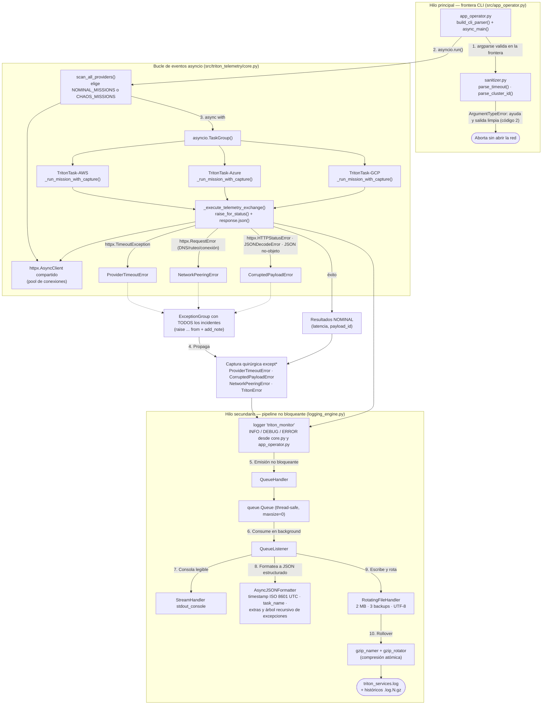

# TritonMonitor — Sistema de Telemetría Multicloud y Observabilidad Asíncrona (Proyecto Tritón)

Trabajo Práctico 1 — Proyecto Tritón.

`triton_monitor` es el monitor CLI oficial del escenario **Proyecto Tritón**: la corporación *Triton Cloud Services* opera clústeres de cómputo críticos distribuidos simultáneamente en tres proveedores de nube (AWS, Azure y GCP) y, durante tormentas de radiación electromagnética, sus nodos de telemetría sufren en paralelo colapsos físicos de red, pérdidas de peering y corrupciones graves de datos. El sistema consulta **APIs HTTP reales** de forma asíncrona y concurrente (un `httpx.AsyncClient` compartido dentro de un `asyncio.TaskGroup`), traduce cada error nativo de red a una excepción semántica de dominio (`TritonError` y sus subclases), agrupa los fallos simultáneos en un `ExceptionGroup` capturado de forma quirúrgica con `except*`, y persiste la telemetría como **JSON estructurado** (timestamp ISO 8601 UTC) mediante un pipeline de logging **no bloqueante** con rotación acotada y compresión gzip. El resultado cumple el requisito central de resiliencia de la consigna: ningún fallo asíncrono o de conexión HTTP real provoca el cierre abrupto de la aplicación.

## Arquitectura y flujo de hilos

El diagrama muestra los dos flujos del sistema. El **flujo principal de ejecución** recorre la frontera CLI (`argparse`), el bucle de eventos `asyncio` con las misiones de telemetría por proveedor y la captura quirúrgica de excepciones. El **flujo de logging no bloqueante** desacopla la escritura física en disco: el event loop solo encola registros en memoria y un hilo secundario (`QueueListener`) se encarga de formatear y persistir.



Puntos clave del flujo:

- **Validación en la frontera**: `sanitizer.py` intercepta los argumentos corruptos (timeout fuera de rango, ID de clúster fuera de patrón) antes de que exista cualquier interacción con el bucle de eventos o la red; el rechazo sale limpio con código de sistema `2`.
- **Concurrencia real**: las tres misiones de telemetría se ejecutan en paralelo como tareas nombradas del `TaskGroup` (`TritonTask-AWS`, `TritonTask-Azure`, `TritonTask-GCP`), compartiendo un único cliente HTTP con pool de conexiones.
- **Mapeo semántico**: `_execute_telemetry_exchange()` convierte cada error nativo de `httpx` en su excepción de dominio con encadenamiento explícito (`raise ... from`) y notas forenses (`add_note()`), preservando intacto el traceback de la causa raíz.
- **Aislamiento de I/O**: el bucle de eventos nunca escribe en disco; toda escritura física se canaliza a través de la cola sincronizada (hard gate de la consigna).

## Requisitos

| Requisito | Detalle |
|---|---|
| Python | **3.11 o superior** — el mínimo lo imponen `asyncio.TaskGroup`, `except*` (PEP 654) y `BaseException.add_note()` (PEP 678). A partir de Python 3.12 el campo `task_name` del log JSON se puebla con el nombre de la tarea `asyncio`; verificado sobre Python 3.14. |
| Dependencia de runtime | `httpx` — fijada como `httpx==0.28.1` en `requirements.txt` (satisface el `httpx>=0.27.0` exigido por la consigna). El archivo también fija `pytest` y `pytest-asyncio` junto con sus dependencias transitivas para la suite de pruebas. |
| Red | Acceso a internet en tiempo de ejecución: `jsonplaceholder.typicode.com` (modo nominal) y `httpbin.org` (modo caos). |

## Instalación

```bash
# 1. Crear y activar un entorno virtual
python3 -m venv venv
source venv/bin/activate        # Windows: venv\Scripts\activate

# 2. Instalar las dependencias
pip install -r requirements.txt
```

No se requiere instalar el paquete ni configurar `PYTHONPATH`: `app_operator.py` importa `triton_telemetry` desde su propio directorio (`src/`), por lo que la CLI se ejecuta directamente desde la raíz del repositorio con `python3 src/app_operator.py ...`.

## Uso

### Opciones de la CLI

```text
python3 src/app_operator.py <proveedores> -c <cluster-id> [opciones]
```

| Opción | ¿Obligatoria? | Descripción |
|---|---|---|
| `proveedores` (posicional) | Sí | Uno o más proveedores a monitorear, restringidos por `choices` de dominio: `AWS`, `Azure`, `GCP`. |
| `-c`, `--cluster-id` | Sí | Identificador del clúster. `parse_cluster_id()` valida por expresión regular el patrón `cluster-<region>-<NN>` (ej.: `cluster-us-east-01`). |
| `-t`, `--timeout` | No | Tiempo límite por petición HTTP, en segundos. Flotante estricto en `[0.1, 5.0]`; por defecto `2.5`. |
| `--chaos` | No | Inyecta fallos reales vía httpbin: timeout de 3 s (AWS), HTTP 504 (Azure) y payload XML corrupto (GCP, `/xml`). |
| `-m`, `--mode` | No | Modo operativo: `nominal` (defecto), `debug` o `emergency`. |
| `--verbose` \| `--quiet` | No | Grupo mutuamente excluyente: salida detallada en consola (incluye DEBUG) o salida mínima (solo WARNING y superior). |

**Códigos de salida**: `0` — ciclo completado, incluidas las corridas donde los incidentes fueron contenidos por los bloques `except*`; `2` — rechazo de validación en la frontera `argparse` (argumentos inválidos o `--verbose --quiet` juntos), sin abrir la red.

### Escenario A — Operación nominal completa (éxito rotundo)

```bash
python3 src/app_operator.py AWS GCP -c cluster-us-east-01 -t 3.0
```

Las consultas a AWS y GCP se ejecutan **en paralelo** contra JSONPlaceholder y la consola imprime el reporte nominal con las **latencias de red reales** y el ID de evento de cada proveedor. Finaliza con código `0`.

### Escenario B — Validación temprana de argumentos fallida (frontera CLI)

```bash
python3 src/app_operator.py AWS GCP -c cluster-invalido-id -t 9.5
```

La aplicación **no inicia consultas de red**: `argparse` atrapa la `ArgumentTypeError` devuelta por `sanitizer.py` (el ID no cumple el patrón de clúster y el timeout `9.5` está fuera del rango `[0.1, 5.0]`), imprime el uso/ayuda autogenerado y **sale limpiamente con código de sistema `2`**.

### Escenario C — Inyección de caos (fallos concurrentes y árbol `ExceptionGroup`)

```bash
python3 src/app_operator.py AWS Azure GCP -c cluster-us-west-02 -t 1.5 --chaos
```

Se gatillan **fallos reales y simultáneos** contra httpbin: AWS consulta `/delay/3` con un límite de `1.5 s` y colapsa por timeout (`ProviderTimeoutError`), Azure recibe un **HTTP 504** y GCP consulta `/xml`, que responde **HTTP 200 con un cuerpo XML** cuyo parseo JSON falla. Los dos últimos incidentes se mapean a `CorruptedPayloadError` — la consigna asigna esa excepción tanto a payloads corruptos como a estatus HTTP fallidos (§2.2.1) y prescribe explícitamente `raise CorruptedPayloadError(...) from error_nativo` para `httpx.HTTPStatusError` (§2.2.2) — con `HTTP_Status_Code` o `Provider_ID`/`Endpoint`/`Content-Type` en las notas forenses. El `TaskGroup` completa todas las tareas, el `ExceptionGroup` llega con el inventario completo de incidentes y los bloques `except*` lo capturan de forma quirúrgica: la consola muestra la cabecera de TIMEOUTS (1 incidente) y la de payloads corruptos / estatus fallidos (2 incidentes) con sus notas FORENSE — sin tracebacks crudos, que el formateador de consola reemplaza por una línea de omisión — mientras el árbol forense completo (`exception_tree` + `stack_trace`) persiste como JSON en `triton_services.log`. El proceso **finaliza con código `0`**, sin cierre abrupto.

> `CorruptedPayloadError` cubre respuestas corruptas, no serializables, fuera de contrato (JSON válido que no es un objeto) y estatus HTTP fallidos (4xx/5xx), según el texto de rol §2.2.1 de la consigna. `NetworkPeeringError` queda exclusivamente para fallos de DNS, ruteo o resolución de hosts — el camino `httpx.RequestError`, ejercitado por la suite de caos con hosts `*.invalid` (test 9) y por cualquier corrida sin conectividad.

### Salida estructurada (log JSON)

Cada corrida escribe `triton_services.log` en el directorio de trabajo desde donde se invocó la CLI. Cada línea es un objeto JSON con `timestamp` ISO 8601 UTC, `level`, `logger`, `message`, `task_name` (nombre de la tarea `asyncio`, ej.: `TritonTask-Azure`), `thread_name`, `filename` y `line`, además de cualquier metadato inyectado vía `extra=` (por ejemplo `provider` y `status_code` en las telemetrías nominales). El formateador `AsyncJSONFormatter` serializa de forma recursiva el árbol de excepciones —clase, mensaje, notas dinámicas de `add_note()`, causas encadenadas con `raise ... from` y `ExceptionGroup` anidados— cuando el registro porta información de excepción. En consola, en cambio, el formateador `ConsoleFormatter` omite los tracebacks crudos y los reemplaza por una única línea informativa (`[traceback omitido en consola — árbol forense completo en triton_services.log]`): la salida del operador queda legible y el árbol forense completo vive solo en el log JSON. Al alcanzar los 2 MB el archivo rota: se conservan hasta 3 históricos comprimidos como `triton_services.log.N.gz` mediante los callbacks de gzip.

## Estructura del proyecto

```text
triton_monitor/
├── src/
│   ├── triton_telemetry/
│   │   ├── __init__.py         # Frontera de imports: expone la API pública del paquete vía __all__
│   │   ├── exceptions.py       # Jerarquía semántica: TritonError → ProviderTimeoutError / CorruptedPayloadError / NetworkPeeringError (heredan de Exception, nunca de BaseException)
│   │   ├── sanitizer.py        # parse_timeout() y parse_cluster_id(): validación estricta en la frontera argparse (exit 2)
│   │   ├── core.py             # scan_all_providers(): TaskGroup, registros NOMINAL_MISSIONS/CHAOS_MISSIONS y mapeo de errores httpx
│   │   └── logging_engine.py   # AsyncJSONFormatter + setup_triton_logging(): cola no bloqueante, RotatingFileHandler y gzip atómico
│   └── app_operator.py         # Punto de entrada CLI: argparse, captura quirúrgica except* y liberación de recursos en finally (PEP 765)
├── tests/
│   ├── conftest.py             # Fixtures: invocación de la CLI por subprocess, sondeo de red y marcadores unit/integration
│   ├── test_chaos_suite.py     # Suite de caos black-box: 11 tests (4 unit sin red + 7 integration con red)
│   └── validate_telemetry.py   # Validador forense del log JSON y de la integridad gzip (incluye --self-test)
 ├── requirements.txt            # Dependencias: httpx (runtime) + pytest / pytest-asyncio (testing)
└── README.md                   # Este documento
```

En tiempo de ejecución se generan localmente `triton_services.log` (y sus históricos comprimidos) y el directorio `venv/`; ambos están fuera del control de versiones.

## Decisiones de diseño destacadas

1. **Wrapper anti-fail-fast en el `TaskGroup`** — `_run_mission_with_capture()` atrapa el `TritonError` de cada misión y lo devuelve como valor; cuando **todas** las tareas terminan, `scan_all_providers()` re-eleva un `ExceptionGroup` con el inventario completo de incidentes. La semántica nativa del `TaskGroup` cancela las tareas hermanas al primer fallo; un monitor de telemetría debe reportar el panorama completo de los tres proveedores en cada ciclo. En el escenario C se reportan los tres incidentes simultáneos (1 timeout + 1 estatus HTTP fallido + 1 payload corrupto).
2. **Mapeo semántico con encadenamiento explícito** — todo error nativo de `httpx` se traduce a una excepción de dominio con `raise ... from native_error` (el traceback de la causa raíz queda intacto) y contexto forense dinámico vía `add_note()`. Los estatus HTTP fallidos (504, 422) y los payloads corruptos o fuera de contrato se mapean a `CorruptedPayloadError` —criterio de los textos de rol de la consigna: §2.2.1 la define para «respuestas corruptas o estatus fallidos HTTP» y §2.2.2 prescribe `raise CorruptedPayloadError(...) from error_nativo` ante `httpx.HTTPStatusError`—. `NetworkPeeringError` queda exclusivamente para fallos de DNS, ruteo o denegación de conexión (el camino `httpx.RequestError`, cubierto por la suite de caos con hosts inexistentes y por corridas sin conectividad).
3. **Emisión de logs no bloqueante** — el bucle de eventos nunca escribe en disco: el logger solo entrega el `LogRecord` al `QueueHandler`, que lo encola en memoria (`queue.Queue`); el hilo secundario del `QueueListener` consume la cola y ejecuta los handlers físicos (consola y archivo). Toda escritura física queda canalizada por la cola sincronizada, como exige el hard gate de la consigna.
4. **Compresión gzip atómica en la rotación** — `gzip_rotator()` comprime el histórico hacia un archivo temporal en el mismo directorio y lo instala con `os.replace()` (reemplazo atómico dentro del mismo sistema de archivos); el archivo plano original se elimina solo después de confirmar que la compresión terminó correctamente. El límite es de 2 MB por archivo con 3 históricos, para acotar el uso de disco.

## Pruebas y validación

```bash
# Suite completa (8 tests) — requiere el entorno virtual activo
python -m pytest tests/

# Solo los tests unitarios (validación argparse, sin red)
python -m pytest tests/ -m "not integration"

# Autotest del validador forense (muestra sintética embebida)
python tests/validate_telemetry.py --self-test

# Reporte forense sobre los logs reales (por defecto: raíz del proyecto)
python tests/validate_telemetry.py [directorio-de-logs]
```

La suite es **black-box**: invoca la CLI por `subprocess` sin importar `src/`, del mismo modo que la operaría un usuario real. Los 5 tests marcados `integration` requieren salida a internet hacia `jsonplaceholder.typicode.com` y `httpbin.org`; sin conectividad se omiten automáticamente (la fixture `requires_network` sondea los hosts antes de fallar). El validador forense certifica los campos requeridos de cada entrada JSON, el dominio de niveles, los códigos de estado HTTP detectados y la integridad de la descompresión gzip de los históricos; sale con código `0` cuando no hay violaciones.


